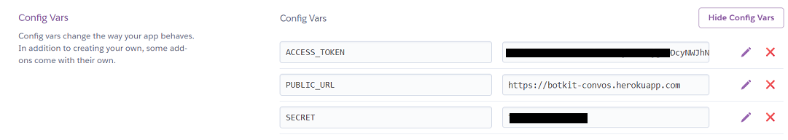

# Botkit template

This project implements a Botkit + Webex Teams adapter bot, based on the [generator-botkit](https://www.npmjs.com/package/generator-botkit) Yoeman template, providing a few extra good-practice features, plus several interesting samples:

- Optionally use Webex Teams Node.js SDK websockets for incoming events and messages, instead of webhooks

- A 'health check' URL: check bot availability, uptime and metadata by browsing to the bot's public URL

- Quality-of-life features: fallback/catch-all module; welcome message when user joins a space

- 'Help' command auto-generation function

- Redis/MongoDB storage support for persistent/scalable storage of conversation state

- checkAddMention() function to automatically format bot commands for 1:1 or group space usage

## Websockets vs. Webhooks

Most Botkit features can be implemented by using the Webex Teams JS SDK websockets functionality, which establishes a persistent connection to the Webex Teams cloud for outbound and inbound messages/events.

Webex Teams also supports traditional HTTP webhooks for messages/events, which requires that your bot be accessible via a publically reachable URL.  A public URL is also needed if your bot will be serving any web pages/files, e.g. images associated with the cards and buttons feature or the health check URL.

- If you don't need to serve buttons and cards images, you can set the environment variable `WEBSOCKET_EVENTS=True` and avoid the need for a public URL
- If you are implementing buttons & cards, you will need a public URL (e. g. by using a service like Ngrok, or hosting your bot in the cloud) - configure this via the `PUBLIC_URL` environment variable 

## How to run (local machine)

Assuming you plan to us [ngrok](https://ngrok.com) to give your bot a publically available URL (optional, see above), you can run this template in a jiffy:

1. Clone this repo:

    ```sh
    git clone https://github.com/CiscoDevNet/botkit-template.git

    cd botkit-template
    ```

1. Install the Node.js dependencies:

    ```sh
    npm install
    ```

1. Create a Webex Teams bot account at ['Webex for Developers'](https://developer.webex.com/my-apps/new/bot), and note/save your bot's access token

1. Launch Ngrok to expose port 3000 of your local machine to the internet:

    ```sh
    ngrok http 3000
    ```

    Note/save the 'Forwarding' HTTPS (not HTTP) address that ngrok generates

1. Rename the `env.example` file to `.env`, then edit to configure the settings and info for your bot.

    >Note: you can also specify any of these settings via environment variables (which will take precedent over any settings configured in the `.env` file) - often preferred in production environments.

    To successfully run all of the sample features, you'll need to specify at minimum a `PUBLIC_URL` (ngrok HTTPS forwarding URL), and a `WEBEX_ACCESS_TOKEN` (Webex Teams bot access token).

    >If running on Glitch.me or Heroku (with [Dyno Metadata](https://devcenter.heroku.com/articles/dyno-metadata) enbaled), the `PUBLIC_URL` will be auto-configured.

    Additional values in the `.env` file (like `OWNER` and `CODE`) are used to populate the healthcheck URL meta-data.

    Be sure to save the `.env` file!

1. You're ready to run your bot:

    ```sh
    node bot.js
    ```

## Quick start on Glitch.me

* Click [](https://glitch.com/edit/#!/import/github/CiscoDevNet/botkit-template)

* Delete the `.env` file that Glitch created automatically

* Rename `.env.example` to `.env`, then open it for editing.

    Find the `WEBEX_ACCESS_TOKEN` variable, paste in your bot's access token

    **Optional**: enter appropriate info in the "Bot meta info..." section

    >Note that, thanks to the Glitch `PROJECT_DOMAIN` env variable, you do not need to add a `PUBLIC_URL` variable pointing to your app domain

You bot is all set, responding in 1-1 and 'group' spaces, and sending a welcome message when added to a space!

You can verify the bot is up and running by browsing to its healthcheck URL (i.e. the app domain.)

## Quick start on Heroku

* Create a new project pointing to this repo.

* Open your app's **Settings** tab, and reveal your **Config Vars**

* Add a `WEBEX_ACCESS_TOKEN` variable with your bot's access token as value

* Add a `PUBLIC_URL` variable pointing to your app's Heroku URL

    >If your app is using [Dyno Metadata](https://devcenter.heroku.com/articles/dyno-metadata), the public URL will be detected automatically

    

* In the upper right under the **More** dropdown, select **Restart all dynos**    

You bot is all set!  You can invite it to 1-1 and 'group' spaces, see it sending a welcome message when added, and responding to commands (try `help`.)

You can always verify the bot is operational by browsing to its healthcheck URL (i.e. the app domain.)