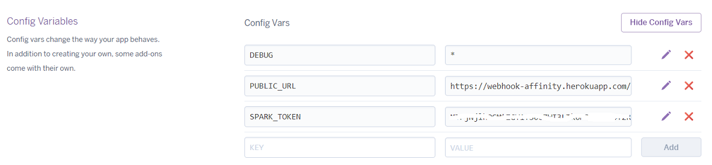

# Botkit Template for Cisco Spark

This template regroups a set of best practices to bootstrap a Botkit project connecting to Cisco Spark.

**take a look at the [redis](https://github.com/CiscoDevNet/botkit-template/tree/redis) and [pluggable architecture](https://github.com/CiscoDevNet/botkit-template/tree/plugin) branches for more advanced templates**

**check [Howdy's Botkit StarterKit](https://github.com/howdyai/botkit-starter-ciscospark) if you're planning to use [Botkit Studio](https://studio.botkit.ai/app)**


## Features

- configuration: pass settings either through environment variables on the command line, or hard-coded values in the `.env` file. Note that command line variables are priorized over the `.env` file if present in both places.

- skills: organize your bot behaviours by placing 'commands', 'conversations' and 'events' in the [skills directory](skills/README.md).

- user experience: the template comes ready-to-use skills: a 'welcome' invite, as well as 'help' and 'fallback' commands.

- healthcheck: easilly check that everything goes well by hitting the `ping` endpoint automatically exposed.

- metadata: expose extra info via command and on a public address so that Spark users can inquire on Bot Author / Legal mentions / Healthcheck endpoint...

- mentions: the appendMention utility function helps Spark users remind to mention the bot in Group spaces.

- popular cloud providers: the bot self-configures when run on Glitch and Heroku (if )


## Quick start on Glitch

Click [](https://glitch.com/edit/#!/import/github/CiscoDevNet/botkit-template)

Then open the `.env` file and paste your bot's token into the SPARK_TOKEN variable.

You bot is all set, responding in 1-1 and 'group' spaces, and sending a welcome message when added to a space,
Its healthcheck is accessible at your application public url, suffixed with "/ping" 

_Note that thanks to Glitch 'PROJECT_DOMAIN' env variable, you did not need to add a PUBLIC_URL variable pointing to your app domain._


## Quick start on Heroku

Create a new project pointing to this repo.

Reach to your app settings, reveal your config variables, and add a SPARK_TOKEN variable with your bot token as value.

Unless your app is using [Dyno Metadata](https://devcenter.heroku.com/articles/dyno-metadata), you also need to add a PUBLIC_URL variable pointing to your app domain.



You bot is all set, responding in 1-1 and 'group' spaces, and sending a welcome message when added to a space,
Its healthcheck is accessible at your application public url, suffixed with "/ping" 


## How to run on your local machine (with ngrok)

Assuming you plan to expose your bot via [ngrok](https://ngrok.com),
you can run this template in a snatch.

1. Create a Bot Account from the ['Spark for developers' bot creation page](https://developer.ciscospark.com/add-bot.html), and copy your bot's access token.

2. Launch ngrok to expose port 3000 of your local machine to the internet:

    ```sh
    ngrok http 3000
    ```

    Pick the HTTPS address that ngrok is now exposing. Note that ngrok exposes HTTP and HTTPS protocols, make sure to pick the HTTPS address.

3. [Optional] Open the `.env` file and modify the settings to accomodate your bot.

    _Note that you can also specify any of these settings via env variables. In practice, the values on the command line or in your machine env will prevail over .env file settings_

    To successfully run your bot, you'll need to specify a PUBLIC_URL for your bot, and a Cisco Spark API token (either in the .env settings or via env variables). In the example below, we do not modify any value in settings and specify all configuration values on the command line.

4. You're ready to run your bot

    From a bash shell:

    ```shell
    git clone https://github.com/CiscoDevNet/botkit-template
    cd botkit-template
    npm install
    SPARK_TOKEN=0123456789abcdef PUBLIC_URL=https://abcdef.ngrok.io node bot.js
    ```

    From a windows shell:

    ```shell
    > git clone https://github.com/CiscoDevNet/botkit-template
    > cd botkit-template
    > npm install
    > set SPARK_TOKEN=0123456789abcdef
    > set PUBLIC_URL=https://abcdef.ngrok.io
    > node bot.js
    ```

    where:

    - SPARK_TOKEN is the API access token of your Cisco Spark bot
    - PUBLIC_URL is the root URL at which Cisco Spark can reach your bot
    - [ngrok](http://ngrok.com) helps you expose the bot running on your laptop to the internet, type: `ngrok http 3000` to launch
